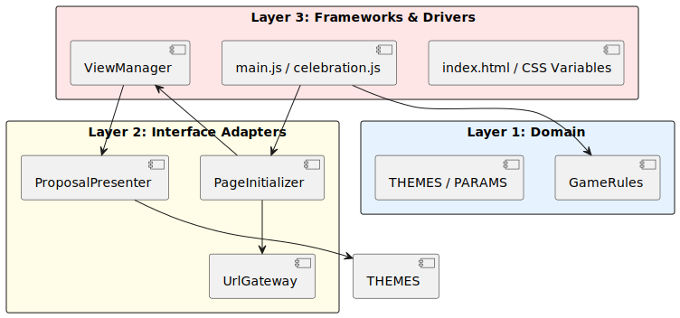
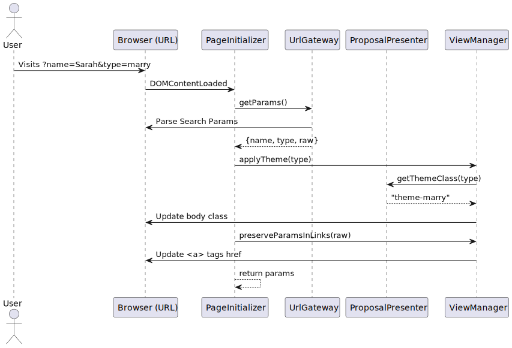

# Architectural Documentation

This project follows the **Clean Architecture** pattern to ensure separation of concerns, testability, and maintainability.

## 🏛️ Layered Structure

The application is divided into three distinct layers, adhering to the **Dependency Rule**: Dependencies only point inwards.

### 1. Domain Layer (Entities & Business Rules)
The core of the application. It knows nothing about the browser, the DOM, or the URL.
- **Entities**: `THEMES`, `PARAMS`, `DEFAULTS`.
- **Logic**: `GameRules` (mathematical calculations for button runaway and growth).

### 2. Interface Adapters
The bridge between the Domain and the outside world.
- **Gateways**: `UrlGateway` (encapsulates URL parameter parsing).
- **Presenters**: `ProposalPresenter` (determines UI strings based on domain state).

### 3. Frameworks & Drivers (The View)
The outermost layer that interacts with Browser APIs.
- **ViewManager**: Handles all direct DOM manipulations and CSS class toggling.
- **Page Scripts**: Controllers (`main.js`, `celebration.js`) that orchestrate the flow.

---

## 📊 Diagrams

### Architecture Overview (Package Diagram)
This diagram visualizes the boundaries and the direction of dependencies.

[View Architecture Overview Source (.puml)](puml/architecture_overview.puml)

### Initialization Sequence
This diagram shows the flow of data when a personalized page is loaded.

[View Initialization Sequence Source (.puml)](puml/initialization_sequence.puml)
